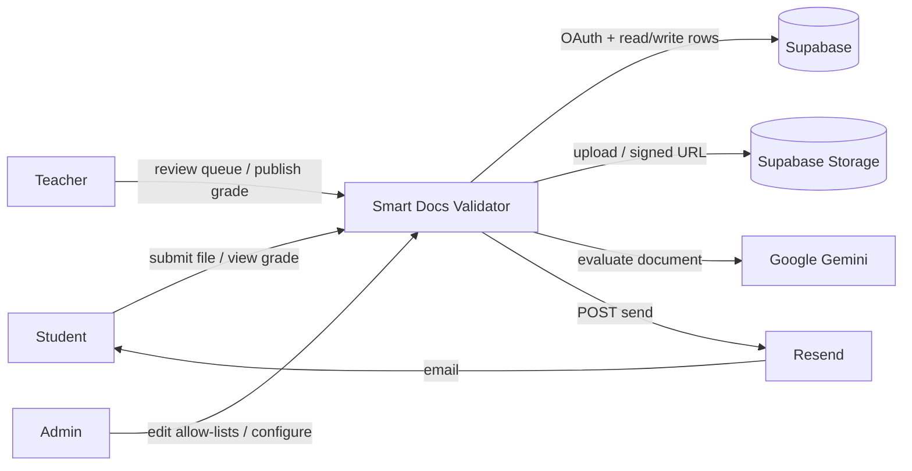
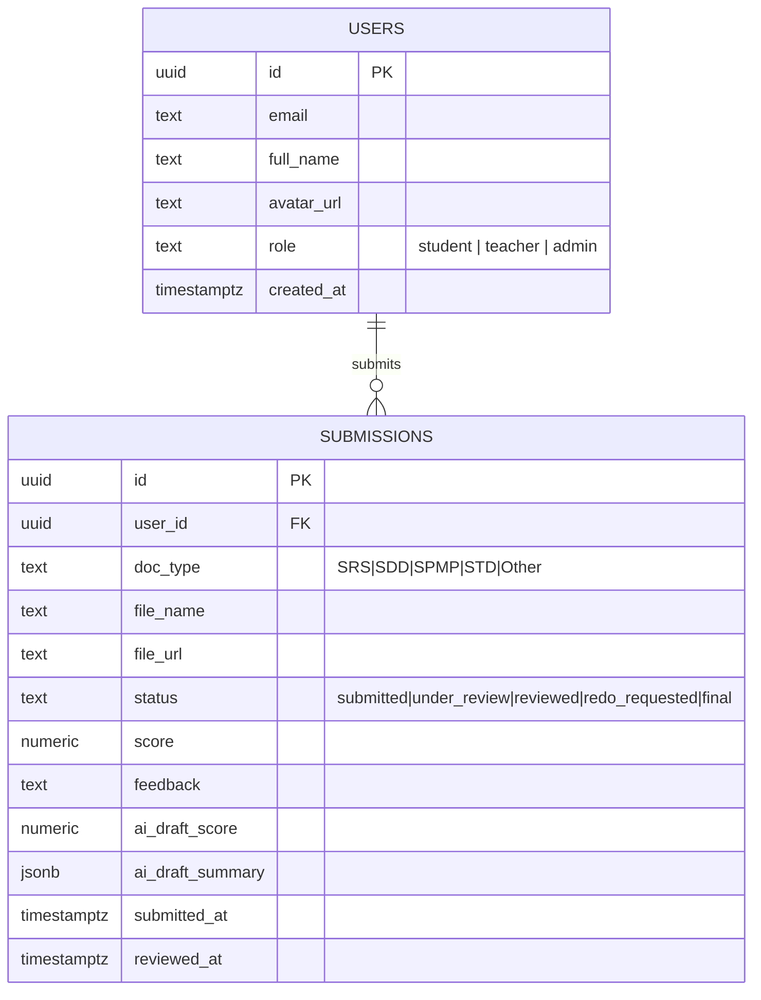
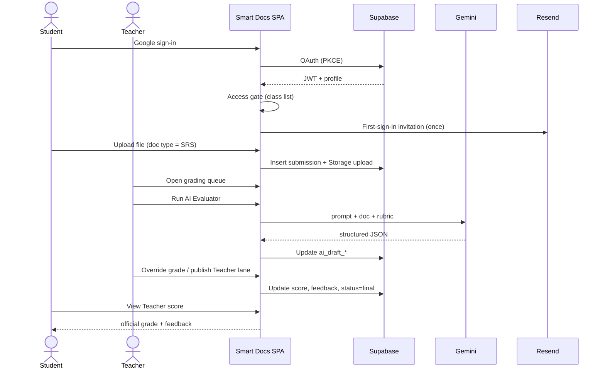
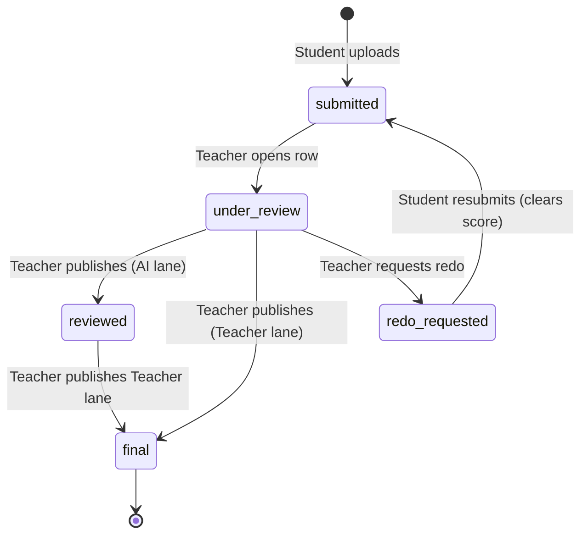
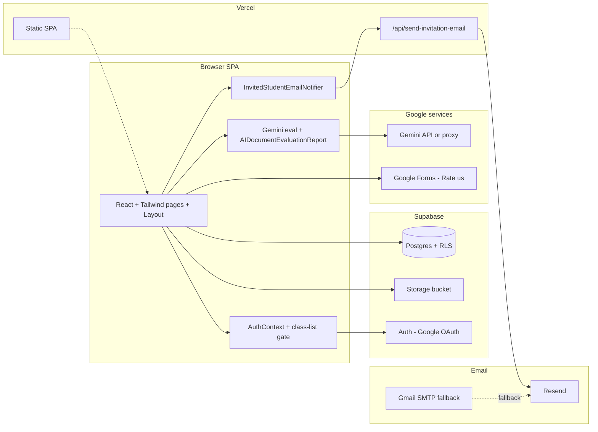

# CEBU INSTITUTE OF TECHNOLOGY – UNIVERSITY

## COLLEGE OF COMPUTER STUDIES

# Software Requirements Specifications

**for**

# Smart Document Evaluator (Smart Docs Validator) with AI Integration

**Prepared by:**
Alexandrei Nash Dinapo
Jeffer Azcona
Jushua Peter Te
Ryan Bebiro

**Date:** May 13, 2026
**Version:** 3.0 (revised to match the deployed system)

---

## Change History

| Name | Date | Reason for changes | Version |
|------|------|--------------------|---------|
| Alexandrei Nash Dinapo | October 27, 2025 | Initial document | 1.0 |
| Project team | December 2025 | Major pivot: Form Builder → Document Grader | 2.0 |
| Project team | May 13, 2026 | Revised to match the deployed Smart Docs Validator system. Removed teacher-creates-assignments scope. Replaced MySQL / Express / GCP stack with the actual React + Supabase + Vercel + Resend + Gemini stack. Added class-list invitation gate, invitation-email pipeline, custom-domain deployment, and current role / module list. | **3.0** |

---

## Table of Contents

1. [Introduction](#1-introduction)
   1.1 [Purpose](#11-purpose)
   1.2 [Scope](#12-scope)
   1.3 [Definitions, Acronyms and Abbreviations](#13-definitions-acronyms-and-abbreviations)
   1.4 [References](#14-references)
   1.5 [Overview](#15-overview)
2. [Overall Description](#2-overall-description)
   2.1 [Product perspective](#21-product-perspective)
   2.2 [User characteristics](#22-user-characteristics)
   2.3 [Constraints](#23-constraints)
   2.4 [Assumptions and dependencies](#24-assumptions-and-dependencies)
3. [Specific Requirements](#3-specific-requirements)
   3.1 [External interface requirements](#31-external-interface-requirements)
   3.1.1 [Hardware interfaces](#311-hardware-interfaces)
   3.1.2 [Software interfaces](#312-software-interfaces)
   3.1.3 [Communications interfaces](#313-communications-interfaces)
   3.2 [Functional requirements](#32-functional-requirements)
   3.3 [Non-functional requirements](#33-non-functional-requirements)
4. [Diagrams](#4-diagrams)
5. [System Architecture & Design](#5-system-architecture--design)
6. [Technologies](#6-technologies)
7. [Testing Plan](#7-testing-plan)
8. [Expected Output](#8-expected-output)
9. [Conclusion](#9-conclusion)

---

## 1. Introduction

### 1.1 Purpose

This Software Requirements Specification (SRS) describes the functional and non-functional requirements of the **Smart Document Evaluator** system (branded in the UI as **Smart Docs Validator**) — an AI-assisted, web-based document evaluation platform built for the **IT332 / CS342** cohort at the Cebu Institute of Technology – University.

The system uses **Google's Gemini API** to generate context-aware rubric scores, executive summaries, per-page Before → After fixes, and visual / diagram review for student submissions. A mandatory **teacher-in-the-loop** review step lets instructors approve, adjust, or override the AI grade before it is released to the student.

This document is intended for:

- Development team members
- Project stakeholders and academic advisors
- Quality-assurance personnel and evaluators
- Faculty and students of the IT332 / CS342 cohort
- System administrators and deployers

The SRS serves as a contract between developers and stakeholders, and as a baseline for verification and validation.

### 1.2 Scope

**Smart Document Evaluator** is a web-based application that lets the IT332 / CS342 cohort:

- Accept document submissions (PDF, DOCX, TXT, and image files) from invited students
- Automatically evaluate submissions using **Google Gemini** against a fixed per-document-type rubric (SRS, SDD, SPMP, STD, Other)
- Provide teachers with a **review queue** to inspect AI results, adjust grades and feedback, and publish either the **AI lane** or the **Teacher lane** independently
- Release final grades and feedback to the originating student
- Export reviewed submissions to **CSV** and provide print-friendly evaluation sheets
- Send **invitation emails** (Resend transactional email, with Gmail SMTP fallback) to students newly added to the class roster

**Important scope clarification:** Teachers **do not create assignments or tasks** in this system. The roster of expected work and the per-document-type rubric is fixed by the course context. Teachers' job is to **review and grade** what students submit, not to author new assignment definitions.

**System overview:** The application is a single-page React app (SPA) backed by Supabase (Postgres + Auth + Storage) and deployed on Vercel under a custom domain. Sign-in is **Google OAuth only**. A class-list **access gate** restricts logins to a fixed allow-list of 45 student Gmail addresses plus whitelisted teacher / admin Gmail addresses. The core grading logic is **AI-first, teacher-final**.

**Major functions:**

- **Google OAuth sign-in** (PKCE) via Supabase Auth, restricted by class-list allow-list
- **Document submission** by students (PDF, DOCX, TXT, image)
- **AI evaluation** via Gemini (or a deployer-owned proxy URL) — rubric scoring, executive summary, Before/After page suggestions, diagram review
- **Teacher review queue** — view AI score, edit / override, publish lane-isolated grades
- **Student portal** — submit work, see AI score and Teacher score in separate read-only views, respond to "redo" requests
- **CSV export** of reviewed submissions
- **Invitation email pipeline** — branded transactional email sent once per invited student on first sign-in

**Benefits:**

- Removes manual transcription of rubric scores; the AI fills the rubric first and the teacher only adjusts
- Standardizes feedback quality across submissions
- Surfaces clear status (`submitted`, `under_review`, `reviewed`, `redo_requested`) for every submission
- Keeps the official numeric grade under instructor control even when AI is enabled

**Target users:**

- **Admin** — manages the role whitelist (via Vercel environment variables), the class-list source file, and the email allow-list
- **Teacher / faculty** — reviews AI grades, publishes final grades, requests redo, exports CSV
- **Student** — submits documents, views final grades and feedback, responds to redo requests

**Out of scope (this revision):**

- Teacher-authored assignments / tasks (the system does not include an "Assignment Builder")
- Native mobile apps (the SPA is responsive but not packaged for app stores)
- Replacement for the institution's official LMS gradebook
- Legal certification of AI outputs as sole evidence of academic integrity

### 1.3 Definitions, Acronyms and Abbreviations

| Term | Definition |
|------|------------|
| **AI** | Artificial Intelligence |
| **API** | Application Programming Interface |
| **SPA** | Single-page application (React + Vite) |
| **OAuth 2.0** | Open standard for access delegation (Google Sign-in) |
| **PKCE** | Proof Key for Code Exchange — OAuth flow used by Supabase Auth |
| **Gemini API** | Google's generative AI model used for document understanding and grading |
| **Vertex AI / AI Studio** | Google Cloud product surface from which Gemini keys are issued |
| **Supabase** | Backend-as-a-service: managed PostgreSQL, Auth, Storage, REST client |
| **RLS** | Row-Level Security — Postgres policies that restrict row access by role and ownership |
| **JWT** | JSON Web Token — the bearer token Supabase issues after sign-in |
| **Vercel** | Hosting provider used for the SPA and the serverless email function |
| **Resend** | Transactional email service used to deliver invitation emails |
| **Nodemailer / SMTP** | Gmail SMTP fallback used by the bulk-send CLI when Resend is unavailable |
| **Class-list allow-list** | The 45-entry Gmail roster in `src/data/invitedStudentEmails.ts` |
| **Doc type** | Label such as **SRS**, **SDD**, **SPMP**, **STD**, **Other** — fixes which rubric template the AI uses |
| **Rubric** | A fixed per-doc-type scoring template; the AI fills it and the teacher reviews it |
| **Submission** | A single file + metadata row uploaded by a student |
| **AI draft / AI lane** | Automated snapshot stored in `ai_draft_score` and `ai_draft_summary` |
| **Teacher lane / Final grade** | Official numeric grade stored in `score` and `feedback` |
| **Review queue** | The teacher dashboard list of AI-graded submissions pending instructor action |
| **CSV export** | Downloadable `.csv` grade report (a lighter alternative to xlsx) |
| **Hardcopy** | Print-friendly formatted evaluation sheet generated by the browser's print view |
| **Eva** | The anime mascot that runs the first-time student onboarding tour |
| **Rate us** | A Google Forms usability survey linked from a floating student-facing button |

### 1.4 References

- Google Gemini API documentation – <https://ai.google.dev/gemini-api/docs>
- Google OAuth 2.0 documentation – <https://developers.google.com/identity/protocols/oauth2>
- Supabase documentation – <https://supabase.com/docs>
- Vercel documentation – <https://vercel.com/docs>
- Resend documentation – <https://resend.com/docs>
- Nodemailer documentation – <https://nodemailer.com>
- IEEE Standard 830-1998 – IEEE Recommended Practice for Software Requirements Specifications
- Data Privacy Act of 2012 (Philippines)
- Project repository documentation – `README.md`, `docs/INVITATION_EMAIL_SETUP.md`, `docs/supabase-setup-all-in-one.sql`

### 1.5 Overview

This document is organized into the following main sections:

- **Section 1 – Introduction.** Purpose, scope, definitions, references.
- **Section 2 – Overall Description.** Product perspective, user characteristics, constraints, assumptions.
- **Section 3 – Specific Requirements.** Interface requirements, functional requirements per module, and non-functional requirements.
- **Section 4 – Diagrams.** DFD Level 0, ERD, sequence and state diagrams.
- **Section 5 – System Architecture & Design.** High-level architecture, deployment architecture, data flow.
- **Section 6 – Technologies.** Tooling and rationale.
- **Section 7 – Testing Plan.** Test types and focus.
- **Section 8 – Expected Output.** Summary of deliverables.
- **Section 9 – Conclusion.**

---

## 2. Overall Description

### 2.1 Product perspective

**Smart Document Evaluator** is a **standalone web application** (not a sub-module of a larger university portal in this build). It sits between students, teachers, and Google's Gemini AI, providing a streamlined "submit → AI grade → teacher review → release" document workflow.

**System context:**

- **Standalone deployment:** Hosted as a single Vercel project on `https://www.smartformevaluator.com` (custom domain) with the default Vercel URL also active.
- **Google authentication only:** No local login form. Strictly Google OAuth 2.0 (PKCE) via Supabase Auth.
- **Class-list allow-list:** Only Gmail addresses on the IT332 / CS342 invitation list (plus whitelisted teacher / admin Gmails) can sign in. Non-listed accounts are immediately signed out at the access gate.
- **File storage:** Uploaded documents are stored in a private Supabase Storage bucket (`student-submissions`) with signed-URL access.
- **AI processing:** The Gemini API (or a deployer-owned proxy URL) analyzes document content against a per-doc-type rubric template.
- **No teacher-authored assignments:** Teachers do **not** create or manage assignments / tasks. The submission targets are implicit per document type. (This is the key change from earlier revisions of this SRS.)

**System interfaces:**

- Web browser UI for all user types (mobile-responsive)
- Google OAuth 2.0 via Supabase Auth
- Google Gemini API (REST) or a deployer-owned HTTPS proxy
- Supabase PostgreSQL for users, submissions, AI drafts, grades, audit fields
- Supabase Storage for uploaded files
- Resend API for transactional invitation emails (with Nodemailer / Gmail SMTP fallback for CLI sends)

**Hardware interfaces:**

- Standard web server infrastructure (managed by Vercel and Supabase; no on-premise hardware)
- No special end-user hardware; accessible from desktop, laptop, tablet, or smartphone

**Software interfaces:**

- **Frontend:** React 18.3.1 + TypeScript 5.6.3 + Vite 5.4.21 + Tailwind CSS 3.4.17
- **Routing:** React Router 7.15.0
- **Backend-as-a-service:** Supabase (PostgreSQL 15.x, Auth Gotrue v2, Storage)
- **Serverless function:** Vercel Functions (Node runtime) – `api/send-invitation-email.ts`
- **Transactional email:** Resend (REST API)
- **CLI / dev tooling:** Node.js 18 LTS+, Nodemailer 8.0.7, `pg` 8.20.0, `sharp` 0.34.5

**Communication interfaces:**

- HTTPS for all browser ↔ Supabase ↔ Gemini ↔ Vercel ↔ Resend traffic
- RESTful JSON for Supabase and Resend
- The Google Generative Language API (Gemini) is called via HTTPS / REST
- SMTP (TLS, port 465) only on the developer's machine when the Gmail fallback CLI is used

**Memory constraints:**

- **Client:** Minimum 2 GB RAM recommended (browser tab)
- **Server:** Managed by Supabase and Vercel — autoscaled
- **Storage:** Supabase Storage capacity is per-project plan (free tier ≥ 1 GB on Supabase free, expandable)

**Operations:**

- Application is publicly reachable 24/7 from the Vercel CDN
- Handles concurrent uploads and concurrent teacher review actions
- Respects Gemini API rate limits via client-side throttling; degrades to a heuristic rubric draft if the API key is missing or unreachable

### 2.2 User characteristics

#### User Type 1 — Admin

- **Role:** Maintains the class-list allow-list (`src/data/invitedStudentEmails.ts`), the email allow-list (in `api/send-invitation-email.ts`), the role whitelist (`VITE_TEACHER_EMAILS`, `VITE_ADMIN_EMAILS`), and deployment configuration.
- **Technical expertise:** High (manages source, env vars, Supabase, DNS).
- **Primary needs:** Edit allow-lists, redeploy, send / re-send invitation emails, dump database, view all submissions and grades.

#### User Type 2 — Teacher / faculty

- **Role:** Reviews submissions, runs the AI evaluator on demand, edits / overrides scores and feedback, requests redo, deletes invalid rows, exports CSV, releases final grades. **Teachers do not create assignments or tasks.**
- **Technical expertise:** Moderate (familiar with LMS-style review queues).
- **Primary needs:** A clear review queue, single-click access to the student file, an AI vs Teacher lane separation that prevents accidental overwrite, and a bulk-action toolbar for routine queue cleanup.

#### User Type 3 — Student

- **Role:** Submits documents, views status, opens AI score and Teacher score in separate dialogs once published, responds to redo requests.
- **Technical expertise:** Basic.
- **Primary needs:** Simple upload, clear submission status, friendly first-run onboarding (Eva), one-click feedback path (Rate us), and a personalized Team 14 page.

### 2.3 Constraints

**Integration constraints**

- Must use **Google OAuth 2.0 only** (no custom email-and-password form).
- Must enforce the **class-list allow-list** at the AuthContext access gate and on the serverless email endpoint.
- Must use a consistent Tailwind-based UI; no other CSS framework is mixed in.

**Regulatory policies**

- Comply with the **Data Privacy Act of 2012 (Philippines)**.
- Obtain consent for data processing through the institutional usage policy.
- Secure storage of student documents and grades — RLS policies enforce per-student visibility.

**Technical constraints**

- **File size limit:** 25 MB per document.
- **Supported formats:** PDF, DOCX, TXT, and common image formats (`.png`, `.jpg`, `.jpeg`, `.webp`). Audio / video attachments are supported only as Gemini multimodal inputs, not as student-submission types.
- **Gemini rate limits:** Default model `gemini-2.5-flash`; per-key quotas apply (typically 60 RPM on free tier).
- **Resend free tier:** 100 emails / day, 3 000 / month. Domain must be DKIM-verified to send to non-account-owner recipients.
- Must handle API failures gracefully — heuristic fallback for Gemini, Gmail SMTP fallback for Resend.

**API constraints (Gemini)**

- Gemini handles entire documents (larger context than legacy NLP APIs), but is priced per-character / per-request.
- Browser-exposed `VITE_GEMINI_API_KEY` is acceptable only for development. Production deployments should use `VITE_GEMINI_EVAL_URL` (a deployer-owned HTTPS proxy) so the API key never reaches the client bundle.

**Parallel operations**

- Support 50+ concurrent users.
- Handle multiple simultaneous uploads.
- Manage API request queuing (client-side throttling + Resend / Gemini server-side rate limiting).

### 2.4 Assumptions and dependencies

**Assumptions**

- All target students have a personal **Gmail** account and that address is on the class-list allow-list. (The earlier `@cit.edu` requirement no longer applies — the project pivoted to Gmail because the cohort uses personal Gmail addresses.)
- Submitted documents are readable and relevant to the document type the student picks.
- Users have stable internet access for upload and download.
- The deployer maintains valid Supabase, Vercel, Resend, and (optionally) Google Cloud / AI Studio billing.

**Dependencies**

1. **External managed services**
   - Google OAuth 2.0 (via Supabase Auth) — critical for sign-in
   - Supabase Postgres + Auth + Storage — critical for persistence
   - Google Gemini API — required for AI grading (heuristic fallback otherwise)
   - Resend — required for invitation emails (Gmail SMTP CLI fallback otherwise)
   - Vercel — hosts the SPA and the serverless email function
   - GoDaddy (or any registrar) — owns the `smartformevaluator.com` domain; DNS delegated to Vercel nameservers
2. **Technology stack** — React 18, Vite 5, TypeScript 5, Tailwind 3, Supabase JS 2.57, react-router-dom 7.15, `mammoth` 1.12, `lucide-react` 0.344, `nodemailer` 8.0, `pg` 8.20, `sharp` 0.34.
3. **Coordination dependencies** — None. This build is **standalone**; it does not need to align with other team projects or be embedded in a wider university portal.

---

## 3. Specific Requirements

### 3.1 External interface requirements

#### 3.1.1 Hardware interfaces

**Client-side hardware**

The system shall be accessible from various computing devices without requiring specialized hardware:

- **Desktop / laptop**
  - CPU: 1.5 GHz or higher
  - RAM: 2 GB minimum
  - Storage: 100 MB free space for temporary files
  - Display: 1024 × 768 resolution or higher
  - Network: 5 Mbps internet connection (10 Mbps recommended for large documents)
- **Mobile / tablet**
  - Modern evergreen browser (Chrome 110+, Safari 16+, Edge 110+, Firefox 110+)

**Server-side / managed infrastructure**

- **Frontend hosting** — Vercel CDN (edge), no self-managed servers
- **Database** — Supabase managed PostgreSQL (2 vCPU, 4–8 GB RAM, 100 GB SSD on the standard tier)
- **Storage** — Supabase Storage (object storage)
- **Email** — Resend (managed)
- **Domain / DNS** — Vercel-hosted DNS (registrar = GoDaddy)
- **Load balancing, SSL termination, health checks** — handled automatically by Vercel and Supabase

**Network requirements**

- Server bandwidth: Vercel managed; no fixed minimum on the application side
- Client internet: 5 Mbps for upload / download, < 100 ms latency for optimal experience

**No special peripherals required**

- Standard keyboard, mouse, touchscreen only
- Webcam / microphone not required
- No fingerprint scanners or biometric devices

**Document processing hardware considerations**

- Scanners / cameras: Optional for students who digitize handwritten work (not system-dependent)
- Printing: Standard printers supported via browser print functionality (`@media print` CSS implemented)

#### 3.1.2 Software interfaces

| ID | Interface | Specification |
|----|-----------|---------------|
| **SI-1** | **Google OAuth 2.0** (via Supabase Auth) | Purpose: user authentication. Protocol: OAuth 2.0 (PKCE). Data format: JWT bearer tokens. Integration: `@supabase/supabase-js` v2.57.4 client. The OAuth client is configured in Google Cloud and registered as a provider in Supabase. |
| **SI-2** | **Google Gemini API** | Purpose: AI document grading. Version: `gemini-2.5-flash` (configurable). Protocol: HTTPS REST. Authentication: API key (dev) or service-owned proxy (`VITE_GEMINI_EVAL_URL`, production). Input: document text + per-doc-type rubric template + multimodal attachments (PDF page images, diagrams). Output: structured JSON merged with the rubric. Fallback: heuristic rubric draft generated entirely in the browser. |
| **SI-3** | **Supabase Storage** | Purpose: store uploaded documents. Bucket: `student-submissions` (private). Access: short-lived signed URLs issued by the Supabase JS client. |
| **SI-4** | **Supabase PostgreSQL** | Tables: `public.users`, `public.assignments`, `public.submissions`, plus RLS policies; AI draft columns (`ai_draft_score`, `ai_draft_summary`) on `submissions`. Client library: `@supabase/supabase-js`. Direct DB client (CLI only): `pg` v8.20.0. |
| **SI-5** | **Resend transactional email** | Purpose: send invitation emails on first sign-in and on bulk-send. From: `Smart Docs <noreply@send.smartformevaluator.com>` (DKIM-verified). Triggered by the Vercel serverless function `/api/send-invitation-email` or the `npm run invite:*` CLIs. |
| **SI-6** | **Nodemailer + Gmail SMTP (fallback)** | Used only by `npm run invite:gmail` from the developer's machine. Host: `smtp.gmail.com:465` (TLS). Authentication: Google App Password. |
| **SI-7** | **CSV export** | Purpose: generate downloadable grade reports. No external library; CSV is composed in-browser from the reviewed submissions and downloaded as a Blob. (xlsx is no longer required.) |
| **SI-8** | **Document parsing** | Client-side text extraction for `.docx` via `mammoth` v1.12.0. PDFs and images are passed directly to Gemini as multimodal `inlineData` parts. |
| **SI-9** | **Google Forms (optional)** | Hosts the **Rate us** student-usability survey. Linked from a floating button in the student shell. |

#### 3.1.3 Communications interfaces

- **HTTPS** to Supabase REST and Auth endpoints
- **HTTPS** to `generativelanguage.googleapis.com` (or to a deployer-owned proxy) for Gemini calls
- **HTTPS** to `api.resend.com` for transactional email
- **HTTPS** to `vercel.app` / `smartformevaluator.com` for the SPA and serverless function
- **SMTPS** to `smtp.gmail.com:465` for the Gmail SMTP CLI fallback (developer machine only)
- **HTTPS/WSS** for Supabase Realtime (reserved for future use; not assumed mandatory in v3.0)

### 3.2 Functional requirements

> **Important:** Earlier revisions of this SRS included a "Module 2 — Assignment Management (Teacher)" with FR-04 (Create Assignment) and FR-05 (Manage Assignments). **Those requirements are removed in v3.0.** Teachers in the deployed system **do not create or manage assignments**. The set of expected document types is fixed and the AI rubric is selected by the student-chosen `doc type` field at submission time.

---

#### Module 1 — Authentication, class-list gate, and role-based access

**FR-01: Google OAuth sign-in**
The system shall allow users to sign in **exclusively** using Google OAuth 2.0 (PKCE) through Supabase Auth. No email/password registration form shall exist.

**FR-02: Class-list allow-list validation**
After a successful Google sign-in, the system shall check that the user's Gmail address is on **at least one** of the following:

1. The student allow-list in `src/data/invitedStudentEmails.ts` (45 entries).
2. The teacher whitelist in the `VITE_TEACHER_EMAILS` environment variable.
3. The admin whitelist in the `VITE_ADMIN_EMAILS` environment variable.

If the address is on none of them, the system shall immediately call `supabase.auth.signOut()` and display the message *"Smart Docs is for IT332 / CS342 students on the official class list only…"* on the login screen.

**FR-03: Role-based access control**
Users shall be assigned exactly one role from `{ student, teacher, admin }`. Role determines accessible routes and queries.
- `admin` ⇒ all teacher routes + admin-only utilities
- `teacher` ⇒ teacher Dashboard, Grading, Student Submissions, Documents, Class list, Analytics, Instructions/Inbox, Settings, Team 14
- `student` ⇒ student Dashboard, Submit work, My Submissions, Tasks, Boards, Calendar, Drive, Sheets, Analytics, Team 14, Settings

**FR-04: Access gate during verification**
While the access checks are running, the system shall display a full-screen "Verifying access" screen. The main application shell shall **not** be mounted at any point for unauthorized accounts.

---

#### Module 2 — Invitation email pipeline *(replaces the removed "Assignment Management" module)*

**FR-05: First-sign-in invitation email**
When an invited student signs in for the first time on a given browser, the system shall POST to `/api/send-invitation-email` and send a branded HTML invitation email to the student's Gmail. The function shall use Resend and the `Smart Docs <noreply@send.smartformevaluator.com>` From address. Subsequent sign-ins shall **not** re-trigger the email (tracked in `localStorage` keyed by user id).

**FR-06: Bulk invitation send**
A teacher / admin shall be able to bulk-send invitation emails from the command line via `npm run invite:send-all` (Resend) or `npm run invite:gmail` (Gmail SMTP fallback). The bulk-send shall support `--only=`, `--skip=`, and `--dry-run` filters and shall iterate the same class-list allow-list.

**FR-07: Invitation-email allow-list**
The serverless email function shall enforce a server-side allow-list (mirroring `src/data/invitedStudentEmails.ts`) and reject POSTs whose `email` field is not on the list with HTTP 403.

**FR-08: Audit log**
Successful and failed sends shall be logged to the browser console with the user id, email, and Resend response id for traceability.

---

#### Module 3 — Document submission (Student)

**FR-09: View submissions and tasks**
Students shall see their submissions and any teacher-requested redo tasks in the **My Submissions** and **Tasks** pages.

**FR-10: Submit document**
Students shall upload a file (PDF, DOCX, TXT, or image) and select a **document type** from `{ SRS, SDD, SPMP, STD, Other }`. The system shall validate file type and size (≤ 25 MB) before upload. The student may resubmit a new file for the same submission; the previous file URL is preserved in the row history.

**FR-11: Submission confirmation and status**
The student shall receive an in-app confirmation of successful upload. Submission status shall be one of: `submitted`, `under_review`, `reviewed`, `redo_requested`, `final`.

---

#### Module 4 — AI evaluation (Gemini integration)

**FR-12: On-demand AI evaluation**
When a teacher clicks **Run AI Evaluator** in the grading workspace, the system shall extract document text (via `mammoth` for `.docx`, raw for `.txt`, multimodal `inlineData` for PDF and images) and send it together with the rubric template for the document type to Gemini (or the configured proxy).

**FR-13: Structured AI response**
The AI evaluator shall return a structured JSON payload containing: total score, per-criterion rubric scores, executive summary, verified-correct excerpts, language corrections, per-page Before → After fixes, and visual / diagram review. The system shall merge this with the rubric template and persist the result to `ai_draft_score` and `ai_draft_summary` on the submission row, setting status to `graded_ai`.

**FR-14: AI failure handling**
If the Gemini call fails (timeout, HTTP error, malformed JSON), the system shall (a) display a clear, friendly notice in the grading modal, and (b) fall back to a deterministic heuristic rubric draft generated locally so the teacher is never blocked.

---

#### Module 5 — Teacher review queue and grading

**FR-15: Review queue dashboard**
The teacher Dashboard and Grading pages shall show all AI-graded and pending submissions across the cohort (subject to RLS), including: student name and avatar, document type, file name, submitted-at, current status, AI score, and Teacher score.

**FR-16: Open submission**
A teacher shall be able to open any submission file (signed URL from Supabase Storage) and see the AI grade and AI narrative side-by-side with the editable teacher fields.

**FR-17: Two-lane publish — AI lane**
When a teacher publishes from the **Grade AI** path, the system shall persist **only** the AI-lane fields (`ai_draft_score`, `ai_draft_summary`, and the row's `status` / `feedback` as configured) and shall **not** overwrite the official `score` column.

**FR-18: Two-lane publish — Teacher lane**
When a teacher publishes from the **Grade Teacher** path, the system shall persist **only** the official `score` and `feedback` (and `status`) and shall **not** overwrite `ai_draft_score` / `ai_draft_summary`.

**FR-19: Request redo**
A teacher shall be able to request resubmission for any row with optional feedback. The submission status shall change to `redo_requested` and the student-side task list shall reflect it. Resubmission clears the published score per `saveReview` semantics.

**FR-20: Bulk delete**
The class list, student submissions, grading, and submission-status pages shall expose a multi-select with a **Delete selected** action, positioned **above** the table header.

---

#### Module 6 — Final grade release and student visibility

**FR-21: Final grade release**
When a teacher publishes a Teacher-lane grade, the submission status shall become `final` and the student shall see the grade in their portal.

**FR-22: Separated student views**
A student shall be able to open two distinct read-only dialogs:
- **View AI score** — shows AI draft total and narrative (when present)
- **View Teacher score** — shows the official numeric grade and instructor feedback

The two dialogs shall be visually and structurally separated so AI output is never presented as the official grade.

**FR-23: Print-friendly view**
Both students and teachers shall be able to open a print-optimized view of the evaluation; CSS `@media print` styles shall be implemented.

---

#### Module 7 — Reporting and export

**FR-24: CSV grade export**
A teacher shall be able to export all reviewed submissions from the grading workspace to a `.csv` file with at minimum the columns: Student Name, Email, Document Type, File Name, AI Score, Teacher Score, Status, Submitted At, Reviewed At.

**FR-25: Analytics dashboard**
The teacher Analytics page shall display: average score, submission counts by status, and AI-vs-Teacher score correlation. The student Analytics page shall display the student's own submission and score history.

---

#### Module 8 — Student onboarding and feedback

**FR-26: Eva onboarding tour**
On the first sign-in for any new student account, the system shall run a short, dismissable guided tour ("Eva") highlighting Dashboard, Submit work, Tasks, Team 14, and Settings. The tour's "seen" flag shall be stored in `localStorage`.

**FR-27: Rate us survey**
A floating **Rate us** button shall be visible in the bottom-right corner of every authenticated student page. Clicking it shall open the Google Forms usability survey configured at `VITE_STUDENT_RATE_US_URL` in a new tab.

**FR-28: Team 14 page**
Both students and teachers shall be able to open a **Team 14** page that displays the project team's roster.

---

#### Module 9 — Audit logging

**FR-29: Server-side audit**
The serverless email function shall log every invitation attempt (success or failure) with timestamp, recipient, and Resend response id.

**FR-30: Client-side audit**
Sign-ins, grade publishes, and bulk-deletes shall be logged to the browser console with the user id and the affected submission id.

---

### 3.3 Non-functional requirements

#### Performance

- AI grading completes within **10 seconds** for typical documents (under load this is dominated by Gemini latency, not the app).
- First-page render is **≤ 2 seconds** on a 5 Mbps connection.
- The system shall support **50 concurrent users** initially.
- Background fetches are **throttled** so the UI does not flicker on alt-tab or route swap.

#### Security

- All data **encrypted in transit** (TLS 1.2+).
- Documents stored in a **private** Supabase Storage bucket, accessed only via short-lived signed URLs.
- **Row-Level Security** policies enforce per-student isolation and teacher-wide visibility.
- No storage of Google or Gemini tokens in `localStorage`; sessions handled by Supabase Auth.
- `RESEND_API_KEY`, `DATABASE_URL`, `GMAIL_APP_PASSWORD`, and any service-role keys are **never** exposed to the browser; they live only in Vercel server-side env vars or the developer's `.env` (which is gitignored).

#### Reliability

- **99.5% uptime** during business hours (inherited from Vercel + Supabase SLAs).
- **Graceful degradation** if Gemini is unavailable — heuristic rubric draft kicks in.
- **Automatic retry** for transient Resend / Supabase failures (up to 3 attempts client-side).
- **Sign-in stability:** Auth state changes for `TOKEN_REFRESHED` do **not** re-run the full access check so the UI does not flicker after alt-tab.

#### Usability

- Mobile-responsive layout (Tailwind breakpoints).
- Clear status indicators on every submission row.
- Floating **Rate us** button always reachable in the student shell.
- Friendly first-time tour ("Eva") removes the need for a separate user manual.
- WCAG 2.1 AA color contrast on the primary maroon palette.

#### Maintainability

- Modular React component structure (`src/components/student/`, `src/components/teacher/`, etc.).
- Environment-based configuration via `.env` + Vercel env vars; no hard-coded secrets.
- Single canonical class-list file (`src/data/invitedStudentEmails.ts`) mirrored once in `api/send-invitation-email.ts`.
- Database schema versioned as SQL files in `docs/`; bootstrap script `npm run db:apply`.
- Database dumps generated via `npm run db:dump` (uses `pg_dump`); stored in the gitignored `db-dumps/` folder.

---

## 4. Diagrams

> Diagrams are maintained alongside this SRS in `docs/diagrams/` (PNG/SVG export) and as Mermaid source where possible. The textual summary of each diagram follows; replace the placeholders below with the actual diagram exports for the submitted PDF.

### 4.1 DFD Level 0 (Context Diagram)

### 4.2 Entity-Relationship Diagram (ERD)

> Note: `assignments` is intentionally **not** modelled as a teacher-authored entity in v3.0. If the schema retains an `assignments` table from earlier revisions, it is treated as a fixed lookup table for doc-type metadata and is **not** mutated by the UI.

### 4.3 Sequence Diagram — complete workflow

### 4.4 State Diagram — submission lifecycle

---

## 5. System Architecture & Design

### 5.1 High-level architecture

### 5.2 Deployment architecture

| Layer | Provider | What runs there |
|-------|----------|-----------------|
| Frontend | **Vercel** (Hobby tier) | Static SPA bundle on the Vercel global CDN |
| Serverless | **Vercel Functions** | `api/send-invitation-email.ts` (Node runtime) |
| Auth + DB + Files | **Supabase** | PostgreSQL, Auth, Storage |
| AI | **Google Gemini** (or deployer proxy) | Generative Language API |
| Email | **Resend** | Transactional sends |
| Domain | **GoDaddy** | Registrar only; DNS delegated to Vercel nameservers |

### 5.3 Data flow architecture

1. User opens `https://www.smartformevaluator.com`.
2. Vercel CDN serves the static SPA.
3. The SPA calls Supabase Auth for Google OAuth (PKCE).
4. AuthContext runs the class-list / role checks; non-listed accounts are signed out.
5. Authenticated UI calls Supabase REST for `users`, `submissions`, and Storage signed URLs.
6. Teacher clicks **Run AI Evaluator** → SPA → Gemini (direct or proxy) → SPA → Supabase update.
7. Invitation send: Notifier → Vercel function → Resend → student inbox.

### 5.4 Module dependency diagram

- `App.tsx` ⇒ `AuthContext` ⇒ `Layout` ⇒ per-role pages
- `geminiDocumentEvaluation.ts` is consumed by both `AIDocumentEvaluationReport.tsx` and the teacher grading workspace
- `sendInvitationEmail.ts` is consumed by `InvitedStudentEmailNotifier` (UI) and shares a template (`scripts/lib/invitationEmailTemplate.mjs`) with the CLI scripts

---

## 6. Technologies

| Layer | Technology (with version) | Reason |
|-------|---------------------------|--------|
| Frontend | **React 18.3.1** | UI framework |
| Frontend | **TypeScript 5.6.3** | Static typing |
| Build tool | **Vite 5.4.21** | Fast dev server + bundler |
| Styling | **Tailwind CSS 3.4.17** + PostCSS 8.5.14 + Autoprefixer 10.4.20 | Utility-first CSS |
| Routing | **react-router-dom 7.15.0** | Client-side routing |
| Icons | **lucide-react 0.344.0** | Icon set |
| Doc parsing | **mammoth 1.12.0** | `.docx` text extraction |
| Backend-as-a-service | **Supabase JS 2.57.4**, Postgres 15.x, Auth (Gotrue v2), Storage | Database, auth, file storage |
| Serverless email | **Vercel Functions** (Node runtime) + **Resend** REST API | Transactional invitation emails |
| Email fallback | **Nodemailer 8.0.7** + Gmail SMTP | CLI bulk sender when Resend domain is not yet verified |
| AI / ML | **Google Gemini API** (`gemini-2.5-flash`, configurable) | Document understanding + rubric scoring |
| Hosting | **Vercel** (Hobby tier) | Auto-deploys from GitHub `main`; managed CDN + SSL |
| Domain / DNS | **GoDaddy** → **Vercel nameservers** | Custom domain `smartformevaluator.com` |
| Survey | **Google Forms** | Optional Rate-us survey |
| Tooling (dev) | ESLint 9.12.0, typescript-eslint 8.8.1, eslint-plugin-react-hooks 5.1.0-rc, eslint-plugin-react-refresh 0.4.12 | Linting |
| Tooling (dev) | **pg 8.20.0** | Postgres client for `npm run db:apply`, `npm run db:dump` |
| Tooling (dev) | **sharp 0.34.5** | Mascot PNG matte removal |
| Runtime | **Node.js 18 LTS** (tested up to 22.x) | Used by Vite, CLIs, and the Vercel function |
| Package manager | **npm 10+** | Lockfile committed |

> **What is NOT in this stack (vs. earlier revisions):**
> - **No Node.js + Express backend.** All server logic is either Supabase or one Vercel function.
> - **No MySQL / Sequelize.** The database is Supabase PostgreSQL.
> - **No Passport.js.** Google OAuth runs through Supabase Auth.
> - **No Socket.IO.** Realtime is not used in v3.0 (Supabase Realtime is reserved for future use).
> - **No Google Cloud Run / App Engine.** Hosting is Vercel.

---

## 7. Testing Plan

| Test type | Focus |
|-----------|-------|
| **Unit testing** | Individual React components, helper libraries (`geminiDocumentEvaluation`, `sendInvitationEmail`, `classRosterCache`), serverless function input validation |
| **Integration testing** | Google OAuth sign-in via Supabase, class-list gate, Gemini integration with both API key and proxy URL paths |
| **File upload testing** | PDF, DOCX, TXT, PNG / JPG, edge cases (0-byte, 25 MB, password-protected, scanned PDFs) |
| **AI accuracy testing** | Compare AI rubric scores vs. teacher-published scores across a sample set; tune prompt template |
| **Email pipeline testing** | `npm run invite:test`, `npm run invite:send-all --dry-run`, end-to-end Resend send, Gmail SMTP fallback |
| **Access-gate testing** | Sign in with a listed Gmail (must succeed), unlisted Gmail (must show steady error, never the app shell), expired Supabase session (must redirect to login) |
| **Load testing** | 50 concurrent users uploading and viewing the grading queue |
| **Usability testing** | Eva onboarding flow for first-time students, Rate us survey completion rate, teacher review-queue clarity |
| **Security testing** | Class-list bypass attempts, RLS policy enforcement (student cannot read another student's submission), Resend allow-list rejection, key-exposure scan |
| **Regression testing** | After any change to `AuthContext`, re-test the gate; after any change to `geminiDocumentEvaluation`, re-test the heuristic fallback path |

---

## 8. Expected Output

A functional web application that:

1. Authenticates users **exclusively via Google OAuth** and enforces a class-list allow-list at the access gate.
2. **Does not** ask teachers to create assignments or tasks — submissions are categorized by a fixed `doc type` chosen by the student.
3. Enables students to upload documents (PDF, DOCX, TXT, image) and respond to redo requests.
4. Automatically grades submissions using **Google Gemini** against a per-doc-type rubric.
5. Provides teachers with a **review queue** with **AI lane / Teacher lane isolation** so neither publish overwrites the other.
6. Releases final grades to students only after the teacher publishes the Teacher lane.
7. Exports grades to **CSV** for record-keeping and supports browser print views.
8. Sends **branded invitation emails** via Resend on first sign-in and on bulk-send.
9. Is deployed end-to-end on **Vercel + Supabase + Resend + GoDaddy DNS** at `https://www.smartformevaluator.com`.

---

## 9. Conclusion

**Smart Document Evaluator** transforms the traditional manual grading workflow into an efficient, AI-assisted, **teacher-in-the-loop** process for the IT332 / CS342 cohort. By leveraging **Google Gemini** to draft rubric scores, executive summaries, and per-page Before / After fixes, the teacher can focus on reviewing and refining feedback rather than grading from scratch.

The deployed v3.0 build deliberately removes the teacher-creates-assignments scope of earlier revisions: the cohort's expected submissions are already known per document type, so the AI rubric is selected automatically and teachers only review. The strict Google OAuth + class-list allow-list aligns with the cohort's privacy requirements, the **two-lane publish** model preserves academic integrity, and the **standalone deployment** on Vercel + Supabase removes the integration overhead of the earlier multi-team vision. The architecture, while small, is modular enough to be re-introduced as a sub-module of a larger university portal in a future revision without rewriting the core grading flow.

This solution directly addresses the professor's requirements for **document processing, AI scoring, teacher review loop, and reporting**, and is the version currently running in production at <https://www.smartformevaluator.com>.

---

*End of SRS document v3.0 — May 13, 2026.*
